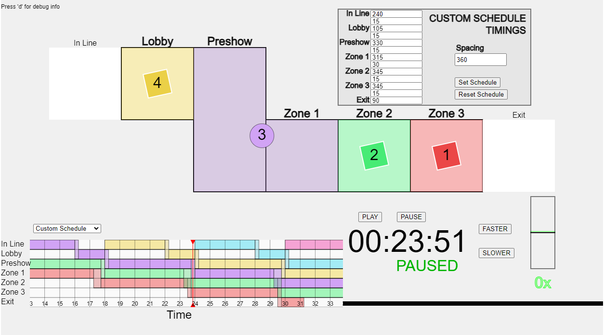

# ScheduleSim

Provides on-rails simulation of a number of groups passing through a technical space with 5 rooms, plus and entry and exit.

## Running the Sim

1. From the Code menu (button) in the upper right of this page, select 'Download ZIP'
2. Extract the contents of the zip folder to your harddrive
3. Open `schedulesim.html` in a web browser by double-clicking it, or from your browser's File menu select Open.

The controls are:
 * The time control buttons in the bottom-right control the speed and flow of time
 * The schedule-selector in the bottom-left selects one of three schedules
 * Roll the mouse wheel up and down to control the zoom level of the graph
 * Click and drag left and and right to scroll the graph.

## Usage

### Room Flow Display

The central part of the simulation represents the 5 main rooms of the experience (Lobby, Preshow, Zone 1, Zone 2, and Zone 3), plus an additional 'space' before the start and after the end to allow visualizing guests entering/existing the experience. Groups are color-coded for easy cross-referencing with the graph below.

When groups are active in a space, they are represented with a rotating diamond shape. While groups are transitioning, they are represented by a dimmed circle.

Each room is filled with the color of the group that is currently either occupying it or transitioning in/out of it.

### Time/Speed Controls

The clock in the lower right displays the relative runtime of the exhibit. The `Play` and `Pause` buttons start and stop the simulation. The `Faster` and `Slower` buttons increase and decrease the run speed, including the ability to reverse the flow of time.

### Schedule Display

#### Graph 
The graph in the bottom-left shows the location of each group as it moves through the 7 key spaces in the exhibit (5 rooms, plus before-entering and after-leaving). When a group is transitioning between spaces, it is shown as occupying both, to avoid groups colliding with or being able to see each other.

Click and

#### Schedule Select

The selector above the schedule display allows the user to select the current schedule. Changing the schedule will reset the simulation time to 00:00.

The schedules are:
  * The schedule as proposed in the 100% DD package, as represented in the Miro graph.
  * A purely "rolling" schedule, where each room is exactly 5.5 minutes and each transition is 15 seconds.
  * A "custom" schedule. This schedule defaults to being the same as the 100% DD schedule, but the duration of each transition and room can be adjusted using the pop-up menu.

